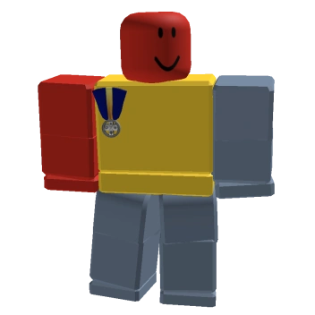

# Onnet (Developer)


This page is for the developer of the game. For the quest-giving NPC, see Onett.


**Piercen Harbut**, better known as Onett on Roblox, is the owner and programmer of Bee Swarm Simulator. Bee Swarm Simulator is his first and main game on Roblox. He owns the Bee Swarm Simulator Club group and Onett's Testing Group.

Onett's Twitter account can be found by searching @OnettDev. Onett also has an Instagram account for the game, a personal Instagram account, a Threads account, a YouTube account, a Twitch account, a Reddit account, and a Discord account (onett1).

Onett lives in the CST timezone, as confirmed on Discord.

<figure><figcaption>
Onnet's Roblox avatar.
</figcaption></figure>

***

## Trivia

* Onett had a cat named Sam in real life, which was the inspiration for Tabby Bee. It passed away later in 2018.
* Onett's favorite bees are Basic Bee, Rascal Bee, Tabby Bee, and Brave Bee.
* Onett's favorite ability is Triangulate, since he thinks it's satisfying.
* Onett's username is a reference to a city in the Nintendo game EarthBound.
* Onett owns a special tool called the Honey Hammer.
* Onett's favorite mob is the Rhino Beetle.
* Onett's favorite in-game music is bpatrol.
* Occasionally, Onett summons mini events. They have various aliases which replace the username, such as "\[Alias] has summoned (a) \[mini event]".
* Onett's birthday is on 12/24/1989, and he is currently <code class="expression">1989</code> years old.
* Onett was interviewed by Thundermaker300 in November 2018 as part of the Roblox Wiki's Developer Connections project. See <i class="fa-1">:1:</i> to read the interview.

## References

<i class="fa-1">:1:</i> — Interview with Thundermaker300

**What was it like developing Bee Swarm Simulator?**

> Fun and refreshing. I had been working on my own game engine for years and to just be able to jump into making a game with an already fully-realized game engine that handles tons of the hard stuff for me (physics, rendering, networking stuff) was something completely new for me. I loved being able to see a game quickly come together and have my doodles come to life.

**What challenges did you have to overcome while developing? What was the most challenging?**

> The most obvious hurdles were learning Roblox Studio and Lua, which all things considered weren’t too challenging. Lua is an easy and flexible scripting language and I’d imagine anyone with programming experience could pick it up fast. I’d say the hardest thing was probably keeping feature scope in check and setting hard deadlines for myself so that Bee Swarm Simulator could just release fast. It was my first Roblox game and I had no clue if I could realistically make money on the platform, so I didn’t want to invest more than 3-4 months into development. And building in general, I had never used any sort of 3D modeling software and even though BSS’s building is simple, I still struggle to put the crudest stuff together.

**What did you enjoy most while developing Bee Swarm Simulator?**

> How quickly you can change stuff around and test the game. I love tweaking stuff then hopping right in and seeing it come to life. Programming the bees and seeing them reach a point where they felt animated and pet-like was a ton of fun. I had fun drawing bees, creating songs, writing lines for the bears, and doing all those different little things that help establish a cohesive tone to the game. And I’m a programmer first and foremost so even though it’s a pain at times I had fun scripting the collection system, the monsters, the bees although I had less fun coding the UI cause it’s a real pain. I also loved having my friends help me test it out, I had never had testers play something I made before and it was just very rewarding to see someone genuinely have fun / get hooked to something I made.

**Is there anything else you'd like to share?**

> Hmm, I guess just how much Bee Swarm Sim has changed my life. I went from struggling for years to put my own games together to quickly producing a game and making a living off it in just a few months, all due to taking a chance on Roblox (which I was skeptical about at first). I also went from living a very quiet and almost hermit like life to having to communicate online with hundreds/thousands of people on a daily basis. Still seems unreal and it can be exhausting maintaining and updating a popular game but I’m just so thankful it happened. BSS is practically all I think about now and even though its just been 6 months I can hardly imagine life without it.

